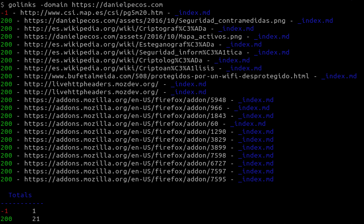
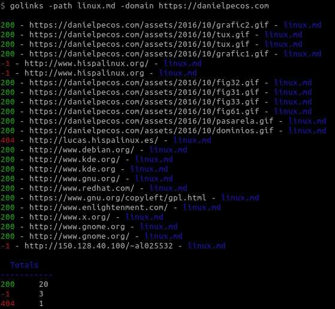

# golinks

Check URLs liveleness of links from text files

# Installation

    go get github.com/dpecos/golinks
    go install github.com/dpecos/golinks

# Usage

    $ golinks -h
    Usage of golinks:
      -domain string
            Domain to use for relative links
      -only-ko
            Show only failed URLs
      -path string
            Path with MD files to check (default ".")
      -workers int
            Number of workers (default 10)

# Example

Cheking links from files in a directory

Cheking links from a single file

# Author

Daniel Pecos Martinez
* https://danielpecos.com
* https://github.com/dpecos
* https://twitter.com/danielpecos